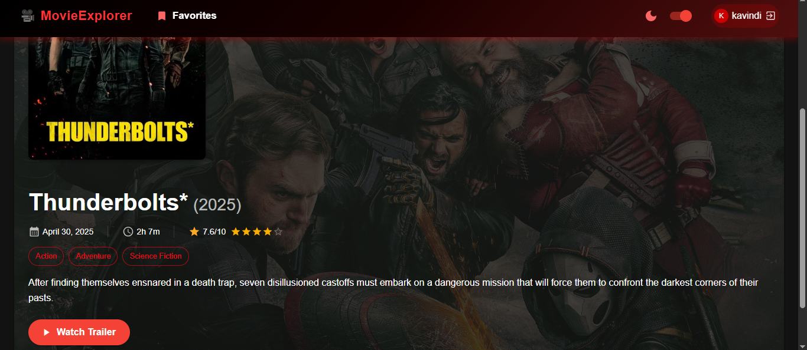

# 🎬 Movie Explorer – Discover Your Favorite Films

Movie Explorer is a modern React web application that allows users to explore trending films, search for movies, and view detailed information using real-time data from The Movie Database (TMDb) API. Built with a responsive interface and powered by React and Material-UI, this app was developed as part of an internship evaluation to demonstrate practical frontend development and API integration skills.


## 🌟 Features
### 🔍 Movie Discovery
- Search for movies by name
- View trending films on the homepage
- Infinite scrolling or “Load More” for search results

### 🖼️ UI/UX
- Responsive, mobile-first design using Material-UI
- Light and dark mode toggle
- Grid layout displaying movie posters with title, rating, and release year
- Clickable cards opening detailed views (overview, genre, cast, trailer)

### 🧠 State Management & Persistence
- Global state handled via React Context API
- Last searched movie stored in local storage
- Users can save favorite movies (persisted locally)

### 🎞️ Extended Functionality
- Filter movies by genre, release year, or rating
- Embedded YouTube trailers
- Graceful handling of API errors with user-friendly messages


## 🔰Tech Stack

- **React.js** – Component-based front-end framework  
- **Axios** – API communication  
- **Material-UI (MUI)** – UI components and styling  
- **TMDb API** – Real-time movie data  
- **React Router** – Navigation and routing  
- **Local Storage** – Data persistence  
- **Netlify** – Deployment and hosting  


## 📡 API Usage

#### This project integrates with **The Movie Database (TMDb) API** to fetch real-time movie data, including trending films, search results, and detailed movie information.

#### Example API calls:
```
const fetchTrending = () => tmdb.get('/trending/movie/week');
const searchMovies = (query) => tmdb.get('/search/movie', { params: { query } });
const getMovieDetails = (id) => tmdb.get(`/movie/${id}`);
```

#### Key endpoints used:

- `/trending/movie/week` - Fetches trending movies of the week

- `/search/movie` - Searches for movies by title

- `/movie/{id}` - Retrieves detailed movie information

- `/genre/movie/list` - Fetches a list of movie genres


## ⚙️ Installation
 To run this project locally:

1. **Clone the repository**
   ```bash
   git clone https://github.com/Kavindi516/Movie-Web_Application.git
   cd Movie-Web_Application
2. **Install dependencies**
   ```bash
   npm install
3. **Configure environment variables**
     
   Create a .env file in the root directory and add your TMDb API key:
   ```bash
   REACT_APP_TMDB_API_KEY=your_tmdb_api_key_here

4. **Configure environment variables**
   ```bash
   npm start
## 🔥Deployment

1. Push your code to GitLab.

2. Go to Netlify and create a new project.

3. Connect your GitLab repository.

4. Set build command to `npm run build` and publish directory to `build`.

5. Add environment variable:

```bash
  REACT_APP_TMDB_API_KEY=your_tmdb_api_key_here

```
6. Deploy and access your app at the generated Netlify link.

## 🚀 Live Demo
Access the deployed application:  
🔗 [https://lustrous-vacherin-dd1cfc.netlify.app/](https://lustrous-vacherin-dd1cfc.netlify.app/)

## 🙏 Acknowledgement

I would like to acknowledge and thank the following resources, libraries, and contributors for their support in building this project:

- **The Movie Database (TMDb)** – for providing an extensive and well-documented movie API.
- **React.js** – for the powerful and efficient front-end library used to build the UI.
- **Axios** – for handling API requests smoothly.
- **Material-UI (MUI)** – for providing modern, responsive UI components.
- **React Router DOM** – for enabling seamless navigation throughout the app.
- **GitHub** – for version control and hosting the project repository.
- **GitHub Pages** – for free and simple deployment of the application.

Their tools and documentation were instrumental in the successful completion of this Movie Explorer application.


## 📸 Screenshots

### 🔐 Login Page


### 🌐 Home Page View


### ❤️ Saved Favorites


### 🎥 Movie Details Page


### 🎛️ Movie Trailer Section


### 📅 Time/Year Filter


### 🔍 Search with Filters


### 🌗 Light/Dark Mode Toggle


### 🎚️ Rating Filter


### 🎭 Genre Filter


### 🌐 Mobile Responsive View

